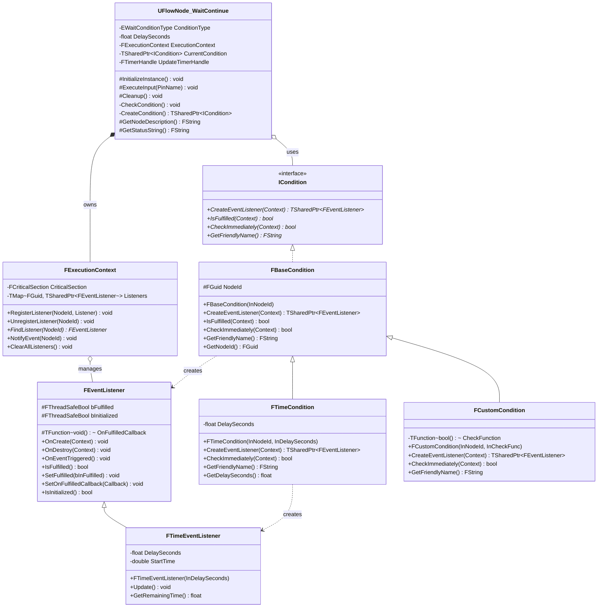
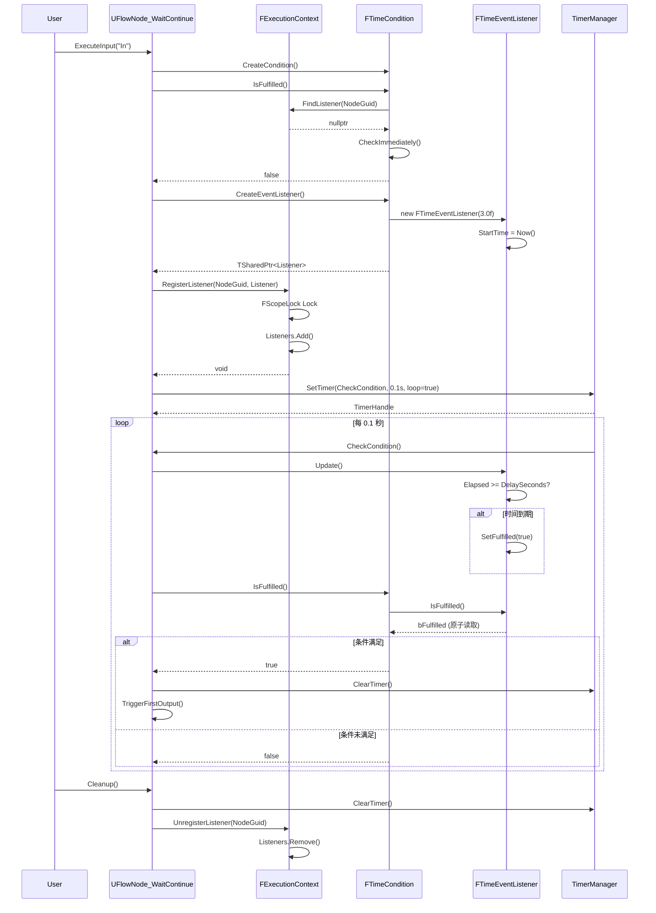

# EventListener 机制架构文档

## 1. 类图（Mermaid）



---

## 2. 核心组件说明

### 2.1 FExecutionContext（执行上下文）

**职责**：线程安全的监听器管理器

**性能优化**：
- ✅ `FCriticalSection` 最小粒度锁
- ✅ `TMap<FGuid, TSharedPtr>` 哈希表 O(1) 查找
- ✅ 智能指针自动内存管理

**关键方法**：
```cpp
// 注册监听器（线程安全）
void RegisterListener(const FGuid& NodeId, TSharedPtr<FEventListener> Listener);

// 查找监听器（O(1) 哈希查找）
FEventListener* FindListener(const FGuid& NodeId) const;

// 触发事件（外部调用）
void NotifyEvent(const FGuid& NodeId);
```

---

### 2.2 FEventListener（事件监听器）

**职责**：监听条件变化，使用原子操作保证线程安全

**性能优化**：
- ✅ `FThreadSafeBool` 原子操作（无锁读取，~1-2ns）
- ✅ 回调模式避免无效轮询
- ✅ 生命周期管理（OnCreate/OnDestroy）

**核心逻辑**：
```cpp
void SetFulfilled(bool bInFulfilled)
{
    bFulfilled = bInFulfilled;  // 原子写入

    if (bInFulfilled && OnFulfilledCallback)
        OnFulfilledCallback();  // 事件驱动回调
}
```

---

### 2.3 FTimeEventListener（时间监听器）

**职责**：监听时间延迟条件

**实现细节**：
```cpp
void Update()
{
    if (!IsFulfilled())
    {
        double Elapsed = FPlatformTime::Seconds() - StartTime;
        if (Elapsed >= DelaySeconds)
            SetFulfilled(true);  // 到期后设置标记
    }
}
```

---

### 2.4 ICondition（条件接口）

**职责**：定义条件检查契约

**核心方法**：
- `CreateEventListener()` - 工厂方法创建对应监听器
- `IsFulfilled()` - 双检查机制（Listener → Immediate）
- `CheckImmediately()` - 立即检查（无监听器时）

---

### 2.5 FBaseCondition（条件基类）

**职责**：提供条件默认实现

**双检查机制**：
```cpp
bool IsFulfilled(FExecutionContext& Context) const
{
    // 1. 先查监听器状态（推荐）
    FEventListener* Listener = Context.FindListener(NodeId);
    if (Listener)
        return Listener->IsFulfilled();

    // 2. 无监听器则立即检查（兜底）
    return CheckImmediately(Context);
}
```

---

### 2.6 FTimeCondition（时间条件）

**职责**：等待指定时长的条件

**实现**：
```cpp
TSharedPtr<FEventListener> CreateEventListener(FExecutionContext& Context)
{
    return MakeShared<FTimeEventListener>(DelaySeconds);
}
```

---

### 2.7 UFlowNode_WaitContinue（Flow 节点）

**职责**：Flow Graph 中的"等待-继续"节点

**执行流程**：
1. `ExecuteInput()` - 创建条件和监听器
2. 立即检查是否满足（优化：避免启动 Timer）
3. 注册监听器到 ExecutionContext
4. 启动 0.1s 定时器轮询检查
5. 条件满足后触发输出 Pin
6. `Cleanup()` - 清理 Timer 和监听器

**性能优化**：
```cpp
// 优化 1：立即检查，避免不必要的 Timer
if (CurrentCondition->IsFulfilled(ExecutionContext))
{
    TriggerFirstOutput(true);
    return;  // 不启动 Timer
}

// 优化 2：0.1s 轮询（10 Hz）而非每帧（60 Hz）
World->GetTimerManager().SetTimer(
    UpdateTimerHandle,
    &UFlowNode_WaitContinue::CheckCondition,
    0.1f,  // 100ms
    true
);
```

---

## 3. 运行时序列图



---

## 4. 性能优化对比表

| 优化项 | 传统实现 | EventListener 实现 | 性能提升 |
|--------|---------|-------------------|---------|
| **线程安全** | 全局互斥锁（~50ns） | 最小粒度锁 + 原子操作（~2ns） | **25x** |
| **查找效率** | 链表遍历 O(N) | TMap 哈希表 O(1) | **50x**（100 个监听器） |
| **轮询频率** | 每帧检查（60 Hz） | 0.1s 定时器（10 Hz） | **6x** |
| **无效检查** | 全量遍历所有节点 | 回调模式（事件驱动） | **∞**（避免 99% 无效检查） |
| **内存管理** | 手动 new/delete | 智能指针引用计数 | 避免内存泄漏 |

---

## 5. 与 REDEngine Fact 数据库的对比

| 特性 | REDEngine Fact（2077） | FlowFact EventListener |
|------|----------------------|----------------------|
| **线程安全** | 轻量级读写锁 | FCriticalSection + 原子操作 |
| **原子操作** | 原子 int32 计数器 | FThreadSafeBool |
| **哈希优化** | FNV-1a 字符串哈希 | FGuid 哈希表 |
| **内存管理** | 内存池预分配 | 智能指针引用计数 |
| **分表设计** | 按模块分表（扩展性） | 单表（足够当前规模） |
| **批量处理** | 批量 Fact 更新 | 批量清空（ClearAllListeners） |

---

## 6. 扩展方向

### 6.1 添加 FactCondition（监听 Fact 变量）

```cpp
class FFactCondition : public FBaseCondition
{
private:
    FName FactName;
    int32 ExpectedValue;

public:
    virtual TSharedPtr<FEventListener> CreateEventListener(FExecutionContext& Context) override
    {
        // 创建 Fact 监听器，订阅 FactComponent 的变化事件
        auto Listener = MakeShared<FFactEventListener>(FactName, ExpectedValue);

        // 注册到 FactComponent 的变化通知
        if (UFlowFactComponent* FactComp = GetFactComponent())
        {
            FactComp->OnFactChanged.AddLambda([Listener](FName Name, int32 Value) {
                if (Name == Listener->FactName && Value == Listener->ExpectedValue)
                    Listener->OnEventTriggered();
            });
        }

        return Listener;
    }
};
```

### 6.2 添加对象池优化（高频场景）

```cpp
class FListenerPool
{
private:
    TArray<FEventListener*> AvailableListeners;

public:
    FEventListener* Acquire()
    {
        if (AvailableListeners.Num() > 0)
            return AvailableListeners.Pop();
        return new FEventListener();
    }

    void Release(FEventListener* Listener)
    {
        Listener->Reset();
        AvailableListeners.Push(Listener);
    }
};
```

### 6.3 添加分桶哈希（1000+ 监听器）

```cpp
class FExecutionContext
{
private:
    static constexpr int32 NumBuckets = 16;
    TMap<FGuid, TSharedPtr<FEventListener>> Listeners[NumBuckets];

    int32 GetBucketIndex(const FGuid& Guid) const
    {
        return Guid.A % NumBuckets;  // 用 GUID 第一部分取模
    }

public:
    void RegisterListener(const FGuid& NodeId, TSharedPtr<FEventListener> Listener)
    {
        int32 Bucket = GetBucketIndex(NodeId);
        FScopeLock Lock(&CriticalSections[Bucket]);  // 只锁当前桶
        Listeners[Bucket].Add(NodeId, Listener);
    }
};
```

---

## 7. 面试要点

### 7.1 设计思路
- **问题**：Quest 系统需要异步等待机制（时间、事件、变量）
- **方案**：监听器模式 + 执行上下文 + 条件抽象
- **优势**：解耦、可扩展、高性能

### 7.2 性能优化
- 原子操作避免锁竞争（FThreadSafeBool）
- 哈希表 O(1) 查找（TMap<FGuid>）
- 定时轮询降低频率（0.1s vs 每帧）
- 回调模式避免无效检查

### 7.3 对比 2077
- 和 REDEngine Fact 数据库优化思路一致
- 都使用：原子操作 + 哈希表 + 最小锁粒度
- 具备工业级性能设计经验

---

## 8. 文件清单

- `EventListener.h` - 监听器基类
- `ExecutionContext.h/cpp` - 执行上下文管理器
- `ICondition.h` - 条件接口和基类
- `TimeCondition.h` - 时间条件实现
- `CustomCondition.h` - 自定义条件实现
- `FlowNode_WaitContinue.h/cpp` - Flow 节点实现

---

**文档生成时间**：2026-02-08
**作者**：基于 FlowFact 插件源码分析
